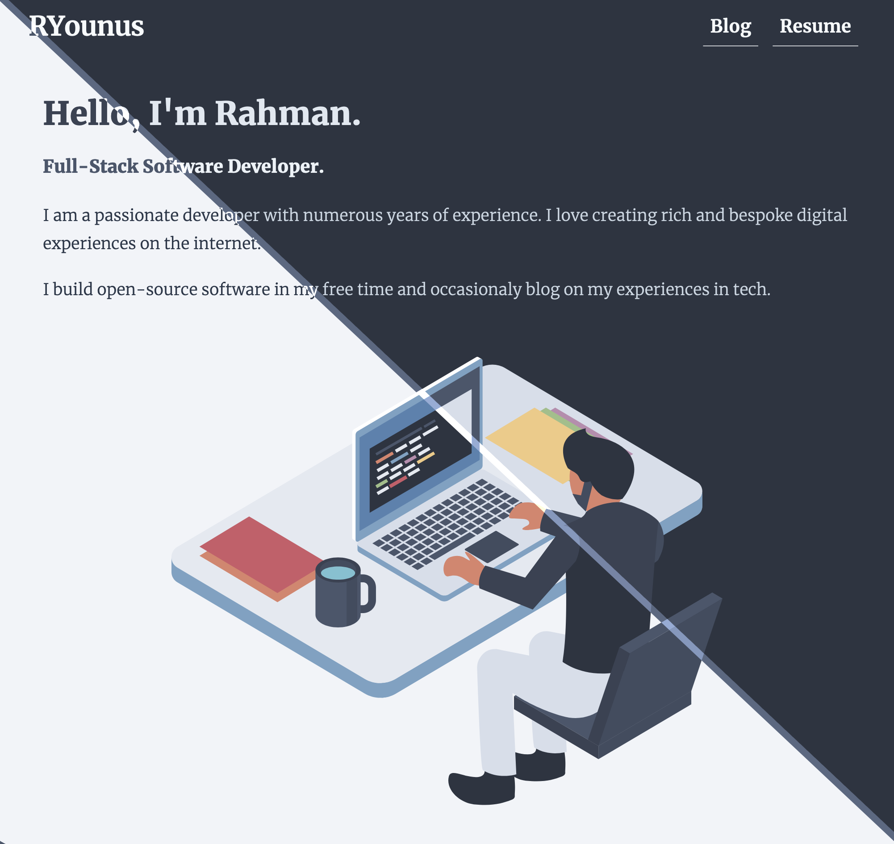
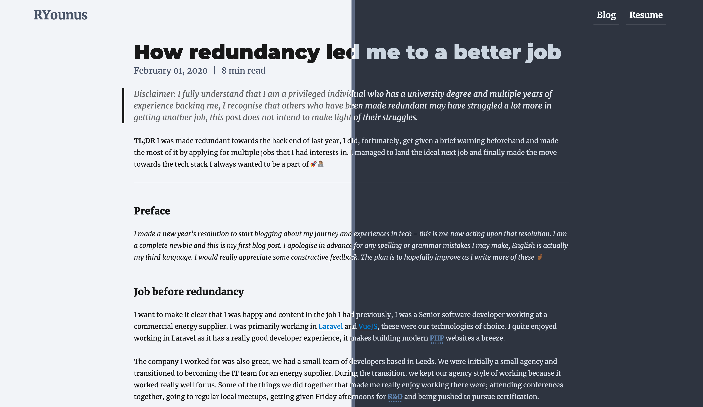

> Disclaimer: Even though I consider myself a full-stack developer, I believe my backend skills are more dominant than my frontend ones. However, I don’t shy away from any frontend work and I actually embrace it for its own unique challenges. This post is based on my personal experience on styling my site and the approach I took. I’m sure there are other ways this could have been implemented and they may even be better solutions but this is my way.

**TL;DR** I implemented dark mode *support* on my site using Tailwind with a one line addition 🌗🚀

The eager eyed amongst you may have had a look under the hood of my website and seen what tech it’s built up on, you don’t need to look far to see the utility first approach I have taken to my CSS. Before you guys run wild and criticise the approach, let me in this post run through the reason why I chose it and why I love it.



### Why Tailwind

Tailwind CSS is a `utility-first` CSS framework for rapidly building custom solutions. It is relatively new and quite well-received in the dev community. To those who may not be familiar with what is meant by `utility-first`, pretty much all the classes you will need already exists. For example, there are width and height utilities available which have an incremental approach allowing you to use the correct classes in your mark-up to achieve something like the snippet below;

```html
<div class="d-block bg-white h-10 w-5 p-5"></div>
```

So, in the above code block, I have applied several utilities to the div element, all applied as several separated *utility classes*. In a more traditional setting, you would need define your own classes with all those properties, give those meaningful names and then use them. You may not see a big benefit in having all the utility classes pre-defined but what it allows you to do is rapidly build and prototype interfaces.

 cache invalidation 2) naming things 🤣")

This utility first approach can however lead to long and ugly class names in your mark-up, but it allows you to develop really quickly and efficiently without writing any custom CSS. I believe it’s one of those concepts that you have to try out for yourself to appreciate. In the Tailwind docs, Adam Wathan, the creator of Tailwind, has specifically created a page to address `utility-first` and its benefits and criticisms, I would recommended doing some [further reading](https://tailwindcss.com/docs/utility-first)

My whole site uses this `utility-first` approach to styling and because of it I have had to use very little custom CSS. Pretty much all of it is predefined for me to use by Tailwind. Below is a snippet of my hero component on my site

```html
<h2 class="heading text-nord-1 text-xl sm:text-3xl md:text-4xl lg:text-5xl xl:text-6xl">
  Hello, I'm Rahman.
</h2>
<h3 class="heading text-nord-3 text-base sm:text-lg md:text-xl lg:text-2xl xl:text-3xl">
  Full-Stack Software Developer.
</h3>
```

As you can see I have quite a few classes in my mark-up which leads to a more expressive way of styling as you know exactly what each class does - each class has a single responsibility. From the example you can also see that all screen-size breakpoints are defined so when those conditions apply the browser will automatically use those classes instead, to use the above snippet as an example you will notice that if a `sm` device is used it will use `text-3xl` whereas if i had a `xl` device I would automatically be using the `text-6xl`. Being able to define these classes across device breakpoints in such an expressive manner for each element is very powerful and efficient. I no longer have to spend time messing with naming schemes for classes, no need for large custom CSS files and therefore no more slower development. 🐌

### What is Dark mode

Dark mode support simply adds a darker variant of the default interface, the colours chosen should be easier on the eye and aim to reduce strain, as the name may suggest usually the colours are of a darker palette.

Dark mode support for websites has slowly been rolling out across the board, more and more apps are now implementing it. I think one of the first apps that I encountered in the wild with dark mode support was Twitter. Most social media platforms have now released dark mode support, just in the last few days my WhatsApp app has been updated to feature a dark mode too. I personally love dark mode as it reduces strain on my eyes at night.

On the web, most browsers now support dark mode via a simple [media query](https://developer.mozilla.org/en-US/docs/Web/CSS/@media/prefers-color-scheme). This now allows you to define queries to correctly pick the correct colour based on the end users system preferences. If you have a look at the browser adoption on [CanIUse](https://caniuse.com/#feat=prefers-color-scheme) it is looking really good, most browsers have support for it.

```css
.box {
  height: 10px;
  width: 10px;
  background: #808080;
  border: 1px solid #000000;
}

@media (prefers-color-scheme: dark) {
  .box {
    background: #d3d3d3;
    border: 1px solid #ffffff;
  }
}
```

Usually the way to implement this using vanilla CSS, you would end up with styling that looks something like the above. You would have to come up with a name for the class, add the correct attributes for the default variant, and then add the media query to override certain attributes if a dark mode is needed.

### My implementation



So the kicker to this whole implementation is a simple one line addition in the default Tailwind config.

```javascript
module.exports = {
  theme: {
    extend: {
      screens: {
        dark: { raw: "(prefers-color-scheme: dark)" }, // <- This line is the magic sauce ✨💫
      },
    },
  },
}
```

That little addition is all that’s needed to basically have dark mode support in Tailwind, crazy right 👀...

Adding this line has allowed us to separate my utilities based on a `dark` breakpoint. So if that `dark` media query applies it will use those styles over the default existing ones.

```html
<div class="bg-white dark:bg-grey"> 
```

Above is an example of how it would look when implemented, the default background colour is defined as white but if the media query is applicable it would use grey instead. As you can imagine this makes implementing dark mode quite a breeze as all I have to do is simply just add the correct class for dark mode.

### Conclusion

To sum up this post, I hope firstly you have found this post useful and insightful to some extent, I would also like to say Tailwind is super awesome and it makes implementing expressive styling easy for developers, especially backend ones like myself. The fact that I don't need any custom CSS files or come up with unique and descriptive class names for my mark-up is a huge win. I can focus my time and attention on creativity and being content driven.
