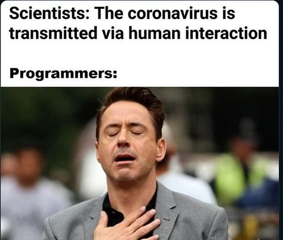

> Disclaimer: I acknowledge that I have not been affected as badly as others have, I'm very thankful for my situation.

**TL;DR** I have been surviving these unprecedented times and combating fatigue by keeping myself healthy both physically and mentally. 👷🏽‍♂️🧠

---

### Preface

I've been taking a bit of a hiatus the past month or so, and have not been blogging as much as I wanted to. This break was due to the current COVID situation and also it being Ramadan last month, I was occupied with fasting and spending a lot of my time focusing on my spirituality.

A blog post is long awaited and I believe the topic I chose is quite timely and suitable for the current circumstances we are in.
Unless you haven been living under a rock, you will know the tough and unprecedented times we are going through, I will try and outline what I've been doing to stay somewhat sane 🤪

_This post will be a lot shorter and more concise than some of my other blog entries._

### My Circumstance

Fortunately for me I have not been affected as badly as others, I'm still working during the lockdown, however from home. This change of working from home has not been very difficult for me as my work place has allowed us to WFH in the past so was quite a minimal change in comparison to other people.

I think a lot of us in the tech industry are very fortunate as we can do most of our work from home. Being able to work from home is a great advantage but it does come with social limitations which we take for granted when in an office environment. I think a lot of developers are not very socially active in the first place so this lockdown is negatively affecting a lot of us in that way.

### What I've been doing

I personally have been trying my best to keep active and healthy during this time, however it's currently a lot more challenging due to the circumstances, but at the same time makes it so much more important. I have been doing a few things both in my personal and work life to try and remediate this;

#### Work

My team at work had the idea of organising semi-regular online socials sessions that will allow us to try help make this whole WFH phase seem more normal and pleasant. These sessions range from online gaming sessions on steam, to pub quizzes, to more personal chats on our work life related stuff. I personally think these sessions are really great and also very beneficial for our mental health. It allows us to experience the social aspect that we kind of lost by no longer going into the office together.

I especially like our pub quizzes as they provide good entertainment and a good healthy competition amongst to us. Unfortunately I don't do as well as some of the others in my team as my general knowledge around popular culture/music from the past century isn't that great as some of the older _and wiser_ members. 👴🏻🦖

#### Home

Since we _was_ in lockdown for the past few months, it was important to find hobbies and activities to keep myself occupied with. The first of these activities that I picked up was to go on regular walks during my lunch breaks at work, since lockdown was in affect recreational places such as gyms were closed. This meant that I had very little physical activity in my day to day routine. This little addition helped me get outside and get fresh air and enjoy the sun when it was shinning. For some reason it seemed like the weather was really good with the sun out on most days whilst in lockdown, but when lockdown finally eased the rainy british weather had unfortunately returned.

Another past time of mine was picking up gaming as a habit, in recent years I have not gamed much. My last proper game console was a PS2 or a Wii, I didn't really bother with the newer stuff until now. I just never really had the time to dedicate to gaming religiously but with the lockdown in effect I suddenly had many hours to spend catching up on a lot classic gaming titles that I had missed out on. I bought a PS4 and a fair few `PS Hit` titles including the games from the `Uncharted series`, `The Last of Us` and `God Of War` to name a few. I think gaming was a really good past time for me during quarantine as it allowed me to not feel bored and kept me entertained with great gripping storylines.

Lastly, I wanted to mention some learning which I have decided to dedicate time on. I have picked up a `Arduino Learning Starter Kit` from Amazon to allow me to fulfill my childhood interest in electronics with my day to day work of coding stuff together. I have been messing with the kit and have been going through the different tutorials to make cool inventions. I have always had an interest in electronics and if I didn't pick Computing as my field of study and work, I would've been doing something in the electronics field. This might be a little blasphemous as a Software Developer but I find the sense of achievement you go through when you build something physically in a 3D space much better than when I code something together on my laptop. 

https://twitter.com/rahmancodes/status/1273289224628908037

I have also been dedicating some time to learning [GoLang](https://golang.org/) and trying to get to grips with all its concepts, look out for a blog post around that in the _near future_ 🚀