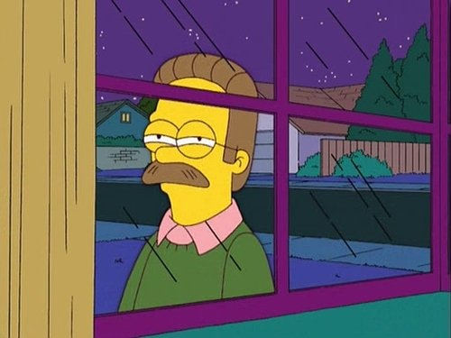
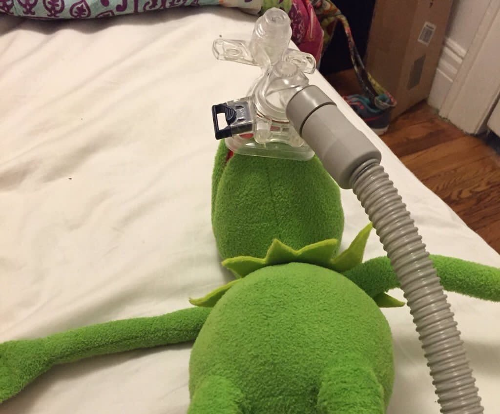

> Disclaimer: I fully understand that I am a privileged individual who has a university degree and multiple years of experience backing me, I recognise that others who have been made redundant may have struggled a lot more in getting another job, this post does not intend to make light of their struggles.

**TL;DR** I was made redundant towards the back end of last year, I did, fortunately, get given a brief warning beforehand and made the most of it by applying for multiple jobs that I had interests in. I managed to land the ideal next job and finally made the move towards the tech stack I always wanted to be a part of  🚀👨🏽‍💻

--- 
### Preface

*I made a new year’s resolution to start blogging about my journey and experiences in tech - this is me now acting upon that resolution. I am a complete newbie and this is my first blog post. I apologise in advance for any spelling or grammar mistakes I may make, English is actually my third language. I would really appreciate some constructive feedback. The plan is to hopefully improve as I write more of these 🤞🏾*

### Job before redundancy

I want to make it clear that I was happy and content in the job I had previously, I was a Senior software developer working at a commercial energy supplier. I was primarily working in [Laravel](https://laravel.com/) and [VueJS](https://vuejs.org/), these were our technologies of choice. I quite enjoyed working in Laravel as it has a really good developer experience, it makes building modern PHP websites a breeze.

The company I worked for was also great, we had a small team of developers based in Leeds. We were initially a small agency and transitioned to becoming the IT team for an energy supplier. During the transition, we kept our agency style of working because it worked really well for us. Some of the things we did together that made me really enjoy working there were; attending conferences together, going to regular local meetups, getting given Friday afternoons for R&D and being pushed to pursue certification.

The company also gave me my first big promotion, I became a Senior developer there. It was a really good move for my career and gave me extra responsibilities and opportunities to take advantage of. I also managed to obtain the [Certified Laravel Developer](https://certification.laravel.com/) certification, I was supported and given the resources I needed to be able to do that.

I did, however, feel like I lost my passion in PHP, I had been working with it since I was at University, I became quite good at it and was missing some of the challenges I faced when working in VueJS. I personally really wanted to move into full-stack JavaScript, using it for both frontend and backend. I believe JavaScript gave me new problems to solve and re-ignited a passion which I think I had lost while working with Laravel. JavaScript kind of had the magpie effect with me, it was a really cool and shiny piece of technology that was full of hype on Twitter and I was hit with FOMO.

> Magpie Effect: *An overwhelming urge to purchase an item of no practical value and/or out of once price range purely based on its appearance.
Usually the item in question is either glittery or catching the light causing the victim to become entranced by said item.* [Urban Dictionary](https://www.urbandictionary.com/define.php?term=Magpie%20Effect)

### Being made redundant

Sometime in October, we had our usual [Daily Stand-up Ceremony](https://www.atlassian.com/agile/scrum/ceremonies) and that’s where we were told the news. We were informed about the probability that we could be made redundant if the company could not gather funds to continue. I remember that month was quite intense and exhausting as we were living in continuous fear of the impending news. I still remember not feeling creative or even motivated to work properly. I used to feel deflated and was quite worried about my livelihood, I had a lot of financial plans and goals that I wanted to aim for in the near future, and this would affect all of them. Whilst this was all going on, the only smart move was to apply for as many jobs as I could.

Fast-forward to around mid-October, we were given the bad news we were expecting but hoped would never receive, we were told we would be made redundant as the company would soon cease trading. It wasn’t really a huge shock to us as we were expecting it. Having said that, being made redundant is still one of the worst feelings I have experienced in my short life. I was fortunate enough to have savings stashed away which I could lean on in tough times. Since we were made redundant mid-month, we also didn’t get our salary for that month, we were required to claim this back from the government and were told that it could take up to 6-8 weeks for us to see it.

### Landing the new Job

One of the companies I had applied for was [DAZN](https://engineering.dazn.com/) - they are a sports streaming company who use a really cool and modern tech stack which includes technologies like; TypeScript, JavaScript, Go, React, AWS Lambda etc. I really liked the sound of the company as they worked in a lot of technologies I wanted to learn or was currently learning myself. I anticipated that working for a big company like this would also look really good on my CV and help me land other bigger opportunities in the future In'sha'Allah, So applying for a job at DAZN was a no-brainer for me.

I was already familiar with the tech recruiter who worked for DAZN, he helped me land my first job out of university in the past. We had a good working relationship and I enjoyed working with him as a recruiter (which is not a typical thing you hear from a developer). I applied for the job myself and contacted the recruiter about it to help fast-track my application as I was on the brink of being made redundant at the time, he was really understanding and helpful.

I was invited in for a formal chat over coffee first to see if the company would be a good fit for me, I went there and really liked what I had heard about the company. It all sounded really positive and exactly like the ideal next move for me. 
I was then sent a technical test to do, I decided to spend 3-5 solid evenings after work on it to really amaze the recruiter and the person who would ultimately judge it. I decided to do it in JavaScript which I had some experience in but wasn’t the language I used the most at my previous jobs. I did this to prove my proficiency in JavaScript and my ability to adapt to change. In the tech test, I also included a lot of bonuses and nice-to-haves to make it even more impressive. Thankfully, they were all really impressed with my attempt and invited me in for a face to face interview. 

I was really nervous about the interview and spent a lot of time preparing for it, it was the ideal opportunity for me. I had spent such a long time on tech test, so I didn’t want it to be futile and a waste of time. The interview went quite well. In hindsight, however, there were a few things I wish I had done better on, but I was feeling generally good about it. Fast forward to Monday, I received a phone call from the recruiter with the news I was hoping for, I was overwhelmed and glad that they chose to offer me the job 🎉✨

### Conclusion

If you’re still here reading this, then I want to say thanks for sticking by, I hope it’s been a good, insightful and entertaining read. As you probably can imagine the end of 2019 was quite an emotional and mental rollercoaster for me, I hope I managed to capture some of those raw feelings in this post. Alhamdulilah, I am still working at DAZN and I am thoroughly enjoying it here; I’m picking up a lot of cool new tech and couldn’t really ask for anything more.

*I believe in a way this whole ordeal was a blessing in disguise as it led me to a better opportunity where I’m happier, more challenged and have job stability.*

*2019 was probably one of my worst years, had a lot of downfalls in my personal life and career. But Alhamdulilah got back up from each one of them, a lot of lessons learnt. To a more prosperous and fruitful 2020 In'sha'Allah*
